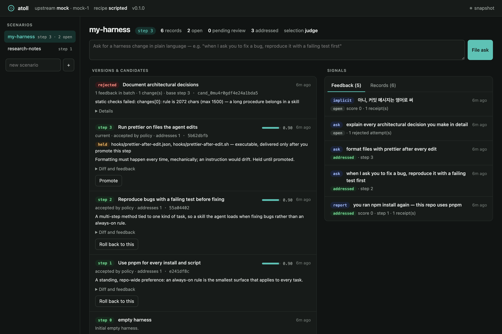

# atoll

**A harness that grows from how you use it.** Tell your coding agent what you want done differently — or just give a thumbs-down — and atoll writes the change as a rule, a skill, a slash command or a hook, checks it, and publishes it as a numbered version your Claude Code project installs.

[한국어 README](README.ko.md)

```bash
git clone https://github.com/didrod205/atoll.git && cd atoll
node bin/atoll.js demo          # one full learning cycle, offline, ~2 seconds
```

No dependencies, no GPU, no API key: by default the model behind atoll is your existing Claude Code login.



<sub>The dashboard, showing seeded example data: three published steps, one candidate rejected by static checks, one hook held until promoted, and an implicit correction picked up from a session.</sub>

---

## What it does

atoll does for an agent **harness** what [Reef](https://github.com/Human-Agent-Society/reef) does for a deployment: it serves requests, records feedback against receipts, grows an update, and commits only the updates that pass evaluation. Reef can also train model weights on GPUs; atoll covers only the harness side, and it is built around Claude Code.

| Step | What happens | Where it lives |
|---|---|---|
| **1 · Serve** | OpenAI- and Anthropic-compatible endpoints. Every response carries an `x-atoll-record-id` receipt. Claude Code sessions are recorded by a `Stop` hook instead. | `src/server.js`, `src/providers.js`, `src/translate.js` |
| **2 · Observe** | Reports (score and/or feedback + receipts), plain-language asks, and implicit corrections ("no, use pnpm") are matched to recorded interactions. | `src/observe.js`, `src/store.js` |
| **3 · Grow** | A recipe turns open feedback into the smallest harness change. The built-in `refine` recipe picks the surface: rule → skill → command → hook. | `src/recipes/`, `src/engine.js` |
| **4 · Commit** | Static checks, an optional evaluator command, and a model judge that also checks earlier feedback for regressions. Accepted changes become `step-N` in a git history; rejected ones leave the current release serving. | `src/evaluate.js`, `src/artifact.js` |

What lands in your project:

| Harness file | Installed as | Delivered |
|---|---|---|
| `rules/<name>.md` | a managed block in `CLAUDE.md` — your own text is never touched | immediately |
| `skills/<name>/SKILL.md` | `.claude/skills/<name>/` | immediately |
| `commands/<name>.md` | `.claude/commands/<name>.md` | immediately, unless it runs shell (`!` or `allowed-tools`) |
| `hooks/<name>.json` + script | `.claude/settings.json` + `.claude/atoll/hooks/` | **held until you promote the step** |

Anything that executes code on your machine is committed but held. A promotion is pinned to the file's content: if a later step changes the script, it is held again.

## Use it with Claude Code

**1. Start the server** (keep it running):

```bash
node bin/atoll.js serve
```

It uses the `claude` CLI, so run `claude` once and `/login` if you haven't. Other backends:

```bash
node bin/atoll.js serve --upstream anthropic --upstream-model claude-sonnet-5   # ATOLL_UPSTREAM_API_KEY
node bin/atoll.js serve --upstream openai --upstream-url http://127.0.0.1:11434 --upstream-model gemma4:26b   # Ollama, vLLM, ...
```

**2. Install the harness into a project** (from the project directory):

```bash
curl -fsS -H "Authorization: Bearer atoll-local" -H "x-atoll-scenario: my-harness" \
  'http://127.0.0.1:8901/atoll/harness/install?target=claude-code' | bash
```

This adds four slash commands, a `SessionStart` hook (update notice) and a `Stop` hook (records each finished turn to your local server), then installs the current version.

**3. Work normally, and say what should change:**

```
/atoll-harness when I ask you to fix a bug, reproduce it with a failing test first
/atoll-report bad you ran npm again — this repo uses pnpm
/atoll-versions            # history; /atoll-versions 3 shows the diff
/atoll-versions 3 promote  # release a held hook
/atoll-versions 2 rollback # publish a new step identical to step 2
/atoll-update              # install the latest version
```

The next session starts with a notice when a new version is ready. Pushback at the start of a prompt ("no, …", "don't …", "아니 …", "그거 말고 …") becomes an implicit report on the previous turn. After two of them, the recipe decides whether they reflect a standing preference.

The dashboard at `http://127.0.0.1:8901/` shows versions, candidates with their diffs and judge verdicts, feedback, and records. From there you can accept, reject, promote or roll back.

## Use it as a server

Any client that speaks OpenAI or Anthropic can go through atoll. The scenario header picks the harness; a new name creates a scenario.

```python
import httpx

atoll = httpx.Client(
    base_url="http://127.0.0.1:8901",
    headers={"Authorization": "Bearer atoll-local", "x-atoll-scenario": "hello-atoll"},
    timeout=300,
)

response = atoll.post("/v1/chat/completions", json={
    "messages": [{"role": "user", "content": "Return exactly: atoll is ready"}],
})
receipt = response.headers["x-atoll-record-id"]
answer = response.json()["choices"][0]["message"]["content"]

matched = answer.strip() == "atoll is ready"
atoll.post("/atoll/report", json={
    "score": float(matched),
    "feedback": "matched" if matched else "wrong answer",
    "references": [receipt],
}).raise_for_status()
```

`feedback` may be a string or an object. When the client speaks the upstream's own format (OpenAI → `--upstream openai`, Anthropic → `--upstream anthropic`), the body is forwarded untouched, so tools, images and streaming all pass through. Otherwise the conversation is translated as text.

<details>
<summary>Endpoints</summary>

| | |
|---|---|
| `POST /v1/chat/completions`, `POST /v1/messages` | inference; response header `x-atoll-record-id` |
| `POST /atoll/report` | `{score?, feedback?, references: [receipt]}` |
| `POST /atoll/harness/ask` | `{text}` — a plain-language change request |
| `POST /atoll/records` | `{prompt, response, tools?, session?}` — interactions recorded outside atoll |
| `POST /atoll/grow` | run a learning cycle now |
| `GET /atoll/versions`, `GET /atoll/versions/:step` | history, one step's diff |
| `POST /atoll/versions/:step/promote` · `/rollback` | release held files · publish an older tree as a new step |
| `GET /atoll/candidates[/:id]`, `POST /atoll/candidates/:id/accept` · `/reject` | review |
| `GET /atoll/harness/manifest` · `/bundle` · `/install?target=claude-code` | delivery |
| `GET /atoll/scenarios`, `POST /atoll/scenarios` `{name, selection?}` | scenarios |
| `GET /atoll/events?token=` | server-sent events for live views |

Auth: `Authorization: Bearer <token>` or `x-api-key: <token>`. Scenario: `x-atoll-scenario` header or `?scenario=`.
</details>

## Deciding what ships

| `--selection` | A candidate that passes static checks is… |
|---|---|
| `judge` (default) | published if the judge says every feedback item is addressed, finds no conflict with earlier feedback, and scores it ≥ `--threshold` (0.7) |
| `manual` | held as *pending* until you accept or reject it |
| `always` | published |

`--evaluator-cmd "<shell>"` runs against a checkout of every candidate tree (`$ATOLL_HARNESS_DIR`); a non-zero exit rejects the candidate. Use it to enforce your own tests, such as linting skills or replaying representative tasks.

A rejection goes back to the recipe with its reason on the next attempt. After two rejections a report is marked *stale* and stops being retried. You can accept a judge rejection yourself; static-check failures cannot be overridden.

## Recipes

`--recipe refine` (default), `--recipe basic` (record only), or `--recipe ./my-recipe.mjs`:

```js
export default {
  name: 'my-recipe',
  triggers(report, openReports) { return report.kind === 'ask'; },   // wake the grower?
  select(openReports) { return openReports.slice(0, 8); },           // which reports go into one update
  async grow({ step, files, reports, records, rejections, history, praise, complete }) {
    const res = await complete({ system: '...', messages: [{ role: 'user', content: '...' }] });
    return { summary, rationale, changes: [{ op: 'write', path: 'rules/x.md', content }], addresses: [reportId], skipped: [] };
  },
};
```

## State

Everything lives under `--state` (default `.atoll/`), one directory per scenario: `records.jsonl`, `reports.jsonl`, `candidates/*.json`, `promotions.json`, and `artifact/` — an ordinary git repository with a `step-N` tag per version, which you can inspect with `git log`.

## Limits

- **Harness only.** No weight training and no test-time training; for those, use Reef.
- **The judge is a model, and by default the same model that wrote the change.** It catches vague and mis-scoped changes but is not a proof. Use `--judge-model`, `--evaluator-cmd`, or `--selection manual` when that matters.
- **Implicit corrections are a narrow heuristic** on the start of a prompt. They only open a report; they never change the harness on their own.
- **The `claude` backend starts one CLI process per call** (seconds, not milliseconds). That is fine for growing and judging; for serving heavy traffic, use an API upstream.
- The demo's `mock` model is deterministic and only proves the plumbing. The quality of the changes depends on the model you run.

```bash
npm test   # 30 tests, node:test, no dependencies
```

MIT
